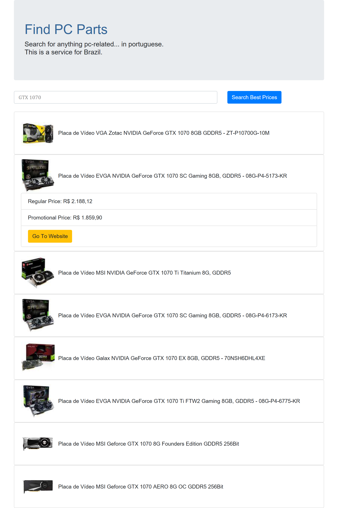

# Find PC Parts - Angular Version

I just saw [this](https://github.com/ViniciusLovato/autoblog-search) and thought I could consume it using Angular.
The only reason I'm using Angular for this is because that's something I want to learn, so the idea is to use the official [Tour of the Hero](https://angular.io/tutorial) to make everything.
And the reason I copied an ideia from Vini Lovato is that it's difficult to have cool ideas and this looks like a cool (and public) idea.

This project was generated with [Angular CLI](https://github.com/angular/angular-cli) version 7.3.7.

## Screenshot

## Prereq

You need to configure an instance of the [autoblog-search](https://github.com/ViniciusLovato/autoblog-search) on the properties (TODO - for now just run on the port 3000).

## Development server

Run `ng serve` for a dev server. Navigate to `http://localhost:4200/`. The app will automatically reload if you change any of the source files.

## Code scaffolding

Run `ng generate component component-name` to generate a new component. You can also use `ng generate directive|pipe|service|class|guard|interface|enum|module`.

## Build

Run `ng build` to build the project. The build artifacts will be stored in the `dist/` directory. Use the `--prod` flag for a production build.

## Running unit tests

Run `ng test` to execute the unit tests via [Karma](https://karma-runner.github.io).

## Running end-to-end tests

Run `ng e2e` to execute the end-to-end tests via [Protractor](http://www.protractortest.org/).

## Further help

To get more help on the Angular CLI use `ng help` or go check out the [Angular CLI README](https://github.com/angular/angular-cli/blob/master/README.md).
